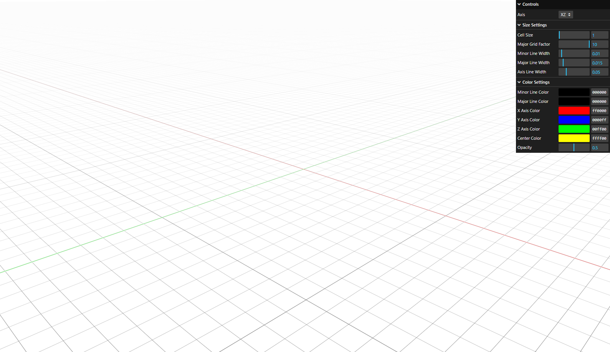

# Three infinite grid

Three.js extension to visualize customizable antialiased grid

[Demo](https://chronos-samples.github.io/three-infinite-grid/) [Github](https://github.com/Chronos-Samples/three-infinite-grid)


Based on this [article](https://bgolus.medium.com/the-best-darn-grid-shader-yet-727f9278b9d8).

## Installation

Install the dependencies

```bash
npm install @chronosai/three-infinite-grid
```

## Usage

```js
/* 
* chunks - size of grid patches matrix (each patch is 20x20 units size)
* a hack with instanced mesh, used to gain more precision within UV coordinates.
*/

const grid = new ThreeInfiniteGrid({
  chunks: new Vector2(100, 100),  //2000x2000 units size     
  plane: PLANE.XZ,
  scale: 1,
  majorGridFactor: 10,
  minorLineWidth: 0.01,
  majorLineWidth: 0.015,
  axisLineWidth: 0.05,
  minorLineColor: new Color("#000000"),
  majorLineColor: new Color("#000000"),
  xAxisColor: new Color("#ff0000"),
  yAxisColor: new Color("#00ff00"),
  zAxisColor: new Color("#0000ff"),
  centerColor: new Color("#ffff00"),
  opacity: 1,
});
scene.add(grid);
```

To make it actually "infinite" move the grid object after `orbitControls.target`, e.g:

```js
//somewhere in update()

if (grid.plane === PLANE.XZ) {
  grid.position.copy(orbitControls.target).setY(0);
}

if (grid.plane === PLANE.XY) {
  grid.position.copy(orbitControls.target).setZ(0);
}

if (grid.plane === PLANE.ZY) {
  grid.position.copy(orbitControls.target).setX(0);
}
```


## License

[MIT](https://choosealicense.com/licenses/mit/)
